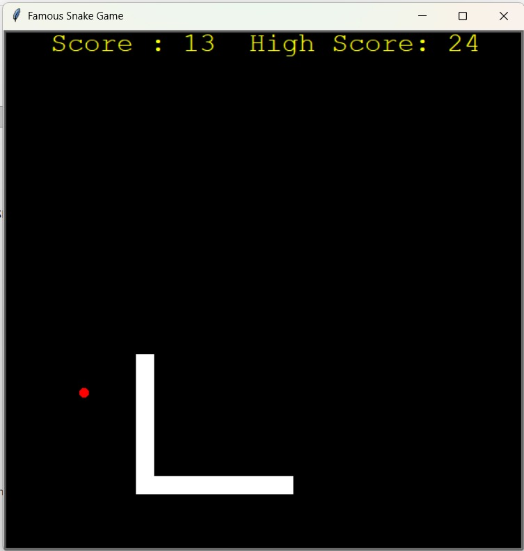

#  Snake Game Python

<p align="center">
  
  
  
  
</p>


---

# 📖 Overview

A classic **Snake Game** built using **Python** and the built-in **Turtle Graphics** module.

The project demonstrates **Object-Oriented Programming (OOP)** principles by organizing the game into multiple modules. It features smooth snake movement, random food generation, collision detection, score tracking, and a persistent high-score system.

---

# 📸 Gameplay

<p align="center">
  
</p>

---

# ✨ Features

- 🐍 Smooth snake movement
- 🍎 Random food generation
- 📈 Live score tracking
- 🏆 Persistent high-score system
- 💥 Wall collision detection
- 🔄 Self-collision detection
- 🎮 Responsive keyboard controls
- 🧩 Object-Oriented Programming (OOP)
- 🚀 Automatic game reset after collision
- 💾 Local high-score storage
- ⚡ Lightweight and beginner-friendly

---

# 🛠 Technologies Used

| Technology | Purpose |
|------------|---------|
| Python 3 | Programming Language |
| Turtle Graphics | Game Rendering |
| Object-Oriented Programming | Modular Code Structure |
| Random Module | Food Generation |
| File Handling | Persistent High Score |

---

# 📂 Project Structure

```text
snake-game-python/
│
├── images/
│   └── game_screenshot.png
│
├── main.py
├── snake1_game.py
├── snake2_game.py
├── snake3_game.py
├── data.txt
├── README.md
├── LICENSE
└── .gitignore
```

---

# 📄 File Description

| File | Description |
|------|-------------|
| `main.py` | Entry point of the game. Creates the game window, initializes objects, handles the main game loop, keyboard input, and collision detection. |
| `snake1_game.py` | Contains the **Snake** class responsible for snake creation, movement, growth, reset logic, and directional controls. |
| `snake2_game.py` | Contains the **Food** class responsible for generating food at random locations whenever the snake eats. |
| `snake3_game.py` | Contains the **Scoreboard** class responsible for displaying the score, managing the high score, and saving it permanently to `data.txt`. |
| `data.txt` | Stores the highest score achieved so it persists between game sessions. |
| `images/` | Stores screenshots and other images used in the README. |

---

# 🧩 Project Architecture

```text
                 +----------------+
                 |    main.py     |
                 +----------------+
                  /      |       \
                 /       |        \
                /        |         \
               ▼         ▼          ▼
      +----------------+ +----------------+ +----------------+
      | snake1_game.py | | snake2_game.py | | snake3_game.py |
      +----------------+ +----------------+ +----------------+
             │                   │                   │
             ▼                   ▼                   ▼
      Snake Movement       Food Generation     Score Management
```

---

# ⚙️ How It Works

### 1️⃣ Game Initialization

The game starts by:

- Creating the Turtle screen
- Setting the screen size
- Enabling keyboard listeners
- Initializing:
  - Snake
  - Food
  - Scoreboard

---

### 2️⃣ Main Game Loop

The game continuously:

- Updates the screen
- Moves the snake
- Detects food collisions
- Detects wall collisions
- Detects self collisions
- Updates the score

---

### 3️⃣ Food Collection

Whenever the snake reaches the food:

- Food relocates to a random position
- Snake grows longer
- Score increases
- High score updates automatically

---

### 4️⃣ Collision Detection

The game checks for:

✅ Wall Collision

- Snake touches the game boundary.

✅ Self Collision

- Snake collides with its own body.

Instead of exiting, the game automatically resets while preserving the highest score.

---

# 🎮 Controls

| Key | Action |
|------|--------|
| ⬆️ Up Arrow | Move Up |
| ⬇️ Down Arrow | Move Down |
| ⬅️ Left Arrow | Move Left |
| ➡️ Right Arrow | Move Right |

---

# 🚀 Getting Started

## Clone the Repository

```bash
git clone https://github.com/yourusername/snake-game-python.git
```

---

## Navigate to the Project

```bash
cd snake-game-python
```

---

## Run the Game

```bash
python main.py
```

---

# 💾 High Score System

The highest score is stored inside:

```text
data.txt
```

Whenever a new record is achieved, it is automatically saved. The score remains available even after restarting or closing the game.

---

# 📚 Concepts Demonstrated

This project showcases:

- Object-Oriented Programming (OOP)
- Python Modules
- Turtle Graphics
- Event Handling
- Keyboard Listeners
- Collision Detection
- File Handling
- Random Number Generation
- Game Loop Design
- Modular Programming
- Code Reusability

---

# 📌 Future Improvements

Potential enhancements include:

- 🔊 Sound effects
- 🎵 Background music
- 🎯 Difficulty levels
- ⏸ Pause / Resume
- 💣 Obstacles
- ⚡ Power-ups
- 🏅 Achievement system
- 🌙 Theme customization
- 🥇 Online leaderboard
- 🎨 Improved graphics using Pygame

---

# 🤝 Contributing

Contributions are welcome!

1. Fork the repository

2. Create a new branch

```bash
git checkout -b feature/YourFeature
```

3. Commit your changes

```bash
git commit -m "Add Your Feature"
```

4. Push your branch

```bash
git push origin feature/YourFeature
```

5. Open a Pull Request

---

# ⭐ Support

If you enjoyed this project or found it useful, consider giving it a **⭐ Star** on GitHub.

Your support helps the project reach more developers and motivates future improvements.

---

# 📜 License

This project is licensed under the **MIT License**.

See the `LICENSE` file for more information.

---

# 👨‍💻 Author

**Prem Kumar**

GitHub: https://github.com/just-prem22

---

<p align="center">
  <b>Made with ❤️ using Python and Turtle Graphics</b>
</p>
